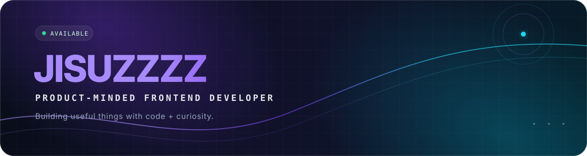

  

   

  
  

  

    <code>ship useful things</code> · <code>polish the details</code> · <code>keep learning</code>
  

## About me

복잡한 아이디어를 직관적인 제품으로 바꾸는 프론트엔드 개발자입니다.
AI를 활용한 제품, 실시간 협업 경험, 그리고 손에 잡히는 인터랙션을 만드는 데 관심이 많습니다.

- 🧩 사용자 흐름부터 데이터 구조까지 함께 고민합니다.
- ⚡ 빠르게 만들고, 실제 사용 경험을 보며 다듬습니다.
- 🌱 웹을 중심으로 모바일과 컴퓨터 비전까지 영역을 넓히고 있습니다.

## Selected work

| Project | What it is | Built with |
| :-- | :-- | :-- |
| [**AutCloud**](https://github.com/jisuzzzz/autcloud_fe) · [Live ↗](https://autcloud-fe.vercel.app) | AI와 드래그 앤 드롭으로 클라우드 인프라를 설계하는 협업 도구 | `Next.js` `TypeScript` `Liveblocks` `Yjs` |
| [**WillB**](https://github.com/jisuzzzz/willb) | 콘텐츠, 스타일, 매거진을 한곳에 담은 패션 플랫폼 | `SvelteKit` `Supabase` `Tailwind CSS` |
| [**AR Sudoku Solver**](https://github.com/jisuzzzz/opencv_ar_sudoku_solver) | 스도쿠 보드를 인식하고 해답을 시각화하는 컴퓨터 비전 프로젝트 | `Python` `OpenCV` |

## Toolbox

  <picture>
    <source media="(prefers-color-scheme: dark)" srcset="https://skillicons.dev/icons?i=ts,react,nextjs,svelte,tailwind,supabase,python,opencv,docker,git,githubactions,vercel&theme=dark&perline=12" />
    <source media="(prefers-color-scheme: light)" srcset="https://skillicons.dev/icons?i=ts,react,nextjs,svelte,tailwind,supabase,python,opencv,docker,git,githubactions,vercel&theme=light&perline=12" />
    
  </picture>

## Contribution trail

<picture>
  <source media="(prefers-color-scheme: dark)" srcset="https://raw.githubusercontent.com/jisuzzzz/jisuzzzz/output/github-contribution-grid-snake-dark.svg" />
  <source media="(prefers-color-scheme: light)" srcset="https://raw.githubusercontent.com/jisuzzzz/jisuzzzz/output/github-contribution-grid-snake.svg" />
  
</picture>

  Always building. Occasionally debugging the debugger.

